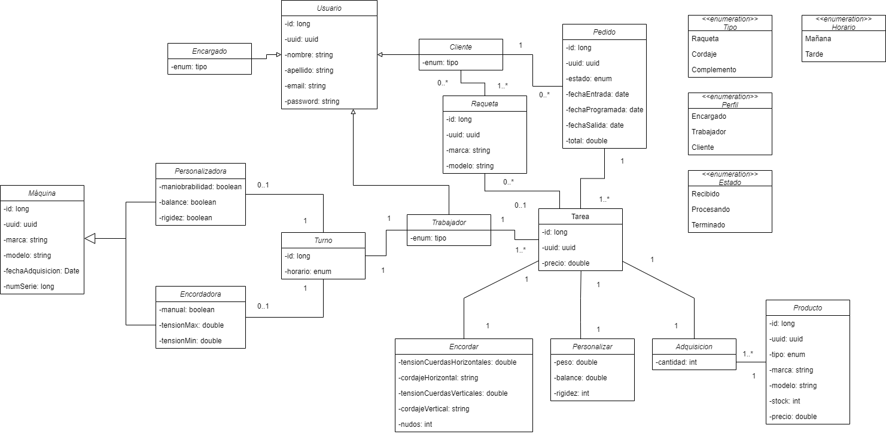

## TennisLab


Proyecto de gestión de base de datos de una tienda de raquetas para la asignatura Acceso a Datos del IES Luis Vives (
Leganés).

## [Vídeo de presentación](https://drive.google.com/file/d/19Bp-N-HHXtHFWn56nco5hsGuS10d6THZ/view?usp=share_link)

## Índice

- [Diseño](#diseño)
- [Estructura del proyecto](#estructura-del-proyecto)
- [Funcionamiento de la aplicación](#funcionamiento-de-la-aplicación)
- [Tests](#tests)

## Diseño

### Introducción

Para la realización de este proyecto se ha pedido que se utilizara la
tecnología [Hibernate-JPA](https://hibernate.org/orm/). [H2](https://www.h2database.com/html/main.html) será la base de
datos que sustentará nuestro proyecto.

Antes de empezar a 'pircar código', el primer paso para desarrollar un proyecto es diseñar el diagrama de clases. Este
diagrama nos permite visualizar cómo se desplegará nuestro proyecto. Así pues, y basándonos en las indicaciones del
ejercicio propuesto, nosotros consideramos que el diagrama de clases sea el siguiente:

### Diagrama de clases



### Configuración del proyecto

Hecho el diagrama, el siguiente pasó fue configurar el proyecto. Para poder utilizar Hibernate con JPA en nuestro
proyecto, utilizamos el [IDE IntelliJ](https://www.jetbrains.com/es-es/idea/) de Jetbrains, el cual (en versión
Ultimate) nos permitía crear un proyecto con [Jakkarta](https://www.jetbrains.com/es-es/idea/). Este tipo de proyecto
nos permite configurar Hibernate con JPA de una manera cómoda y fácil. Al generar el proyecto, en el apartado de '
dependencies', solamente tenemos que agregar 'Persistence' e 'Hibernate', con lo que, al finalizar la creación del
proyecto, nos aparecerá un archivo nuevo llamado 'Persistence.xml'. En dicho archivo podremos configurar nuestra base de
datos, desde las clases que se convertirán en las tablas, hasta el tipo de driver que se usará. El resultado con la
configuración deseada fue el siguiente:

````xml
<?xml version="1.0" encoding="UTF-8"?>
<persistence xmlns="http://java.sun.com/xml/ns/persistence" version="2.0">
    <persistence-unit name="default">
        <description>BBDD de tennisLab con Hibernate-JPA</description>
        <provider>org.hibernate.jpa.HibernatePersistenceProvider</provider>

        <class>models.Producto</class>
        <class>models.Adquisicion</class>
        <class>models.Encordar</class>
        <class>models.Personalizar</class>
        <class>models.usuario.Encargado</class>
        <class>models.usuario.Cliente</class>
        <class>models.usuario.Trabajador</class>
        <class>models.maquina.Encordadora</class>
        <class>models.maquina.Personalizadora</class>
        <class>models.Turno</class>
        <class>models.Raqueta</class>
        <class>models.Tarea</class>
        <class>models.Pedido</class>

        <properties>
            <property name="hibernate.connection.url" value="jdbc:h2:mem:tennisLab;DB_CLOSE_DELAY=-1;"/>
            <property name="hibernate.connection.driver_class" value="org.h2.Driver"/>
            <property name="hibernate.show_sql" value="true"/>
            <property name="hibernate.hbm2ddl.auto" value="update"/>
        </properties>
    </persistence-unit>
</persistence>

````

En nuestro caso se
utilizó [Gradle](https://gradle.org/) para gestionar las dependencias que necesitaría el proyecto:

````kotlin
dependencies {
    implementation('org.hibernate:hibernate-core:5.6.14.Final')
    // Base de Datos H2 Driver JDBC
    implementation("com.h2database:h2:2.1.214")
    // Para hacer el logging
    implementation('io.github.microutils:kotlin-logging-jvm:3.0.3')
    implementation('ch.qos.logback:logback-classic:1.4.4')
    // gson
    implementation("com.google.code.gson:gson:2.10")
    //Mockito
    testImplementation("io.mockk:mockk:1.13.2")
    testImplementation("org.junit.jupiter:junit-jupiter-api:${junitVersion}")
    testRuntimeOnly("org.junit.jupiter:junit-jupiter-engine:${junitVersion}")
    //Dokka Documentación Kotlin
    dokkaHtmlPlugin("org.jetbrains.dokka:kotlin-as-java-plugin:1.7.20")
}
````

Nos hemos servido de otras dependencias para manejar el proyecto de una manera más amena y rápida, tales como
los [Logs](https://github.com/MicroUtils/kotlin-logging) para
las salidas de texto en el terminal, [Gson](https://github.com/google/gson) para que los resultados de las búsquedas
salieran en formato [Json](https://es.wikipedia.org/wiki/JSON). Por último, hemos
usado [Dokka](https://github.com/Kotlin/dokka) para que la documentación del código quedara más presentable.

### Configuración de la base de datos

La configuración de la base de datos depende solo de una clase: HibernateManager. Esta clase nos permite abrir y cerrar
la base de datos, además de hacer todas las operaciones mediante transacciones. La configuración de dicha clase ha sido
la siguiente:

````kotlin
object HibernateManager : Closeable {
    private var entityManagerFactory = Persistence.createEntityManagerFactory("default")
    lateinit var manager: EntityManager
    private lateinit var transaction: EntityTransaction

    init {
        manager = entityManagerFactory.createEntityManager()
        transaction = manager.transaction
    }

    fun open() {
        log.debug { "Iniciando EntityManagerFactory" }
        manager = entityManagerFactory.createEntityManager()
        transaction = manager.transaction
    }

    override fun close() {
        log.debug { "Cerrando EntityManager" }
        manager.close()
    }

    fun query(operations: () -> Unit) {
        open()
        try {
            operations()
        } catch (e: SQLException) {
            log.error { "Error en la consulta: ${e.message}" }
        } finally {
            close()
        }
    }

    fun transaction(operations: () -> Unit) {
        open()
        try {
            log.debug { "Transaction iniciada" }
            transaction.begin()
            operations()
            transaction.commit()
            log.debug { "Transaction finalizada" }
        } catch (e: SQLException) {
            transaction.rollback()
            log.error { "Error en la transacción: ${e.message}" }
            throw SQLException(e)
        } finally {
            close()
        }
    }
}
````

Realizada la configuración, solo queda desarrollar las demás clases: modelos, repositorios, controladores,
etc.

## Estructura del proyecto

Para que nuestro proyecto estuviera lo más ordenado posible, se ha optado por una estructuración de clases basada en sus
funciones. Asi pues, se compartimentó las clases de la siguiente manera: Models, Repositories y
Controllers,
además de las clases que gestionan las excepciones y el cifrado de las contraseñas.
Al tener muchas clases, se optará por enseñar una de ejemplo y así no ser repetitivos.

### Models

````kotlin
@Entity
@Table(name = "adquisiciones")
@NamedQueries(
    value = [
        NamedQuery(name = "Adquisicion.FindAll", query = "select a from Adquisicion a")
    ]
)
data class Adquisicion(
    @Id
    val id: Long,
    @Expose val uuid: UUID = UUID.randomUUID(),
    @Expose var cantidad: Int,

    @OneToOne(cascade = [CascadeType.ALL], orphanRemoval = true)
    @JoinColumn(name = "producto_id")
    @Expose var producto: Producto? = null,
    @Expose var precio: Double? = producto?.precio?.times(cantidad),

    @OneToOne(fetch = FetchType.EAGER)
    var tarea: Tarea? = null
) {
    override fun toString(): String {
        return GsonBuilder().setPrettyPrinting().excludeFieldsWithoutExposeAnnotation()
            .create().toJson(this)
    }
}
````

Como podemos observar, esta clase está compuesta por una serie de atributos, además de una clase externa. Se han
utilizado las etiquetas @Expose para que, al imprimir por terminal la información, salga solo la información con dicha
etiqueta. En este caso, no queremos que el ID de la clase nos aparezca. Esto se complementa con el toString(), que
devuelve la información en formato Json, capando los atributos que aparecen o no.
En el caso de Hibernate-JPA, se han usado las etiquetas @Entity para indicar que esta clase será una tabla, @Table para
indicarle que la tabla se llamará de una forma determinada, @Id para indicar cuál es la clave primaria de la clase y la
etiqueta @OneToOne para indicar la relación del objeto externo y esta clase. Aparte de este etiqueta, nos podemos
encontrar otras como @OneToMany, @ManyToOne o @ManyToMany. Las etiquetas depende del tipo de relación que tengan con las
otras tablas.

### Repositories

Para realizar los repositorios, primero se ha creado una interfaz genérica con una serie de funciones que implementarán
los demás repositorios.

````kotlin
interface CrudRepository<T, ID> {

    fun findAll(): List<T>

    fun findById(id: ID): T?

    fun save(entity: T): T

    fun delete(entity: T): Boolean
}
````

Para cada clase Model que diseñemos, tendremos dos más en el repositorio, una siendo de tipo Interfaz y otra que lo
implementará.

### Interface

````kotlin
interface AdquisicionRepository : CrudRepository<Adquisicion, Long> {
}
````

### Implement

````kotlin
class AdquisicionRepositoryImpl : AdquisicionRepository {

    override fun findAll(): List<Adquisicion> {
        log.debug { "findAll()" }
        var adquisiciones = mutableListOf<Adquisicion>()
        HibernateManager.query {
            val query: TypedQuery<Adquisicion> =
                manager.createNamedQuery("Adquisicion.FindAll", Adquisicion::class.java)
            adquisiciones = query.resultList
        }
        return adquisiciones
    }

    override fun findById(id: Long): Adquisicion? {
        log.debug { "findById($id)" }
        var adquisicion: Adquisicion? = null
        HibernateManager.query {
            adquisicion = manager.find(Adquisicion::class.java, id)
        }
        return adquisicion
    }

    override fun save(entity: Adquisicion): Adquisicion {
        log.debug { "save($entity)" }
        HibernateManager.transaction {
            manager.merge(entity)
        }
        return entity
    }

    override fun delete(entity: Adquisicion): Boolean {
        var result = false
        log.debug { "delete($entity)" }
        HibernateManager.transaction {
            val adquisicion = manager.find(Adquisicion::class.java, entity.id)
            adquisicion?.let {
                manager.remove(it)
                result = true
            }
        }
        return result
    }

}
````

### Controllers

En la clase Controller, diseñaremos las funciones que hará el CRUD (Create, Read, Update, Delete) en nuestro proyecto. A
este controlador se le inyectará el repositorio específico para cada clase.

````kotlin
class AdquisicionController(private val adquisicionRepository: AdquisicionRepository) {
    fun createAdqusicion(adquisicion: Adquisicion): Adquisicion {
        log.info("Creando adquisicion $adquisicion")
        adquisicionRepository.save(adquisicion)
        return adquisicion
    }

    fun getAdquisiciones(): List<Adquisicion> {
        log.info("Obteniendo Adquisiciones")
        return adquisicionRepository.findAll()
    }

    fun getAdquisicionById(id: Long): Adquisicion {
        log.debug { "Obteniendo adquisicion con id $id" }
        return adquisicionRepository.findById(id) ?: throw GenericException("Adquisicion con id $id no encontrada")
    }

    fun updateAdquisicion(adquisicion: Adquisicion): Adquisicion {
        log.debug { "Actualizando $adquisicion" }
        return adquisicionRepository.save(adquisicion)
    }

    fun deleteAdquisicion(it: Adquisicion): Boolean {
        log.debug { "Borrando adquisicion $it" }
        return if (adquisicionRepository.delete(it))
            true
        else
            throw GenericException("Adquisicion con id ${it.id} no encontrada")
    }
}
````

### Cifrador y clase Exception

Parte de la práctica era transformar el password de los usuarios en
formato [SHA-512](https://es.wikipedia.org/wiki/SHA-2)

````kotlin
object Cifrador {

    fun encryptString(input: String): String {
        return try {
            val md = MessageDigest.getInstance("SHA-512")
            val messageDigest = md.digest(input.toByteArray())
            val no = BigInteger(1, messageDigest)
            var hashtext = no.toString(16)
            while (hashtext.length < 32) {
                hashtext = "0$hashtext"
            }
            hashtext
        } catch (e: NoSuchAlgorithmException) {
            throw RuntimeException(e)
        }
    }
}
````

Y para controlar las excepciones, o por lo menos para indicar dónde y qué función ha tenido un posible problema, se ha
creado una clase genérica que implementamos en diferentes clases de nuestro proyecto.

````kotlin
class GenericException(mensaje: String) : RuntimeException(mensaje) {}
````

La decisión de utilizar una única excepción es porque la alternativa era crear una por cada clase, pero teniendo el
mismo contenido y realizando lo mismo, por lo que simplificamos en una que nos funcionara en las demás clases.

## Funcionamiento de la aplicación

Nuestro trabajo culmina en la clase Main, donde iniciamos la base de datos con información con la que trabajar y el CRUD
de cada tabla creada. Al ser un Main tan extenso, enseñaremos el CRUD de una sola clase.

Para poder hacer el CRUD de una tabla, primero hemos creado una clase donde introducimos información. Como nuestro
ejemplo es la clase Adquisición, dicha clase implementa un objeto externo, en este caso la clase Producto. Es por ello,
que en el ejemplo, aparecerá información de las dos clases.

### Datos

````kotlin
fun getProductosInit() = listOf(
    Producto(
        id = 1L,
        tipo = Producto.Tipo.RAQUETA,
        marca = "Babolat",
        modelo = "Pure Aero",
        stock = 3,
        precio = 279.95
    ),
    Producto(
        id = 2L,
        tipo = Producto.Tipo.COMPLEMENTO,
        marca = "Wilson",
        modelo = "Dazzle",
        stock = 5,
        precio = 7.90
    )
)

fun getAdquisicionInit() = listOf(
    Adquisicion(
        id = 1L,
        cantidad = 1,
        producto = getProductosInit()[0],
    ),
    Adquisicion(
        id = 2L,
        cantidad = 4,
        producto = getProductosInit()[1]
    )
)
````

Estando en Main, el último paso es realizar el CRUD, y para ello seguiremos un orden: Implementar los controladores de
cada clase, la inserción de información y el CRUD.
El resultado es el siguiente:

### Iniciar la base de datos

````kotlin
fun initDataBase() {
    HibernateManager.open()
    HibernateManager.close()
}
````

### Main

````kotlin
fun main(args: Array<String>) {
    initDataBase()

    //Controllers
    val productoController = ProductoController(ProductoRepositoryImpl())
    val adquisicionController = AdquisicionController(AdquisicionRepositoryImpl())

    //Inserción de datos
    val productosInit = getProductosInit()
    productosInit.forEach { producto ->
        productoController.createProducto(producto)
    }
    val adquisicionesInit = getAdquisicionInit()
    adquisicionesInit.forEach { adquisicion ->
        adquisicionController.createAdqusicion(adquisicion)
    }

    //CRUD
    //Producto
    //FindAll
    val producto = productoController.getProductos()
    producto.forEach { println(it) }
    //FindById
    val productoId = productoController.getProductoById(producto[0].id)
    println(productoId)
    //Update
    val productoUpdate = productoController.getProductoById(producto[0].id)
    productoUpdate.let {
        it.stock += 3
        productoController.updateProducto(it)
    }
    println(productoUpdate)
    //Delete
    val productoDelete = productoController.getProductoById(producto[0].id)
    productoDelete.let { if (productoController.deleteProducto(it)) println("Producto eliminado") }

    //Adquisicion
    //FindAll
    val adquisicion = adquisicionController.getAdquisiciones()
    adquisicion.forEach { println(it) }
    //FindById
    val adquisicionId = adquisicionController.getAdquisicionById(adquisicion[0].id)
    println(adquisicionId)
    //Update
    val adquisicionUpdate = adquisicionController.getAdquisicionById(adquisicion[0].id)
    adquisicionUpdate.let {
        it.cantidad += 1
        it.precio = it.precio?.times(it.cantidad)
        adquisicionController.updateAdquisicion(it)
    }
    println(adquisicionUpdate)
    //Delete
    val adquisicionDelete = adquisicionController.getAdquisicionById(adquisicion[0].id)
    adquisicionDelete.let { if (adquisicionController.deleteAdquisicion(it)) println("Adquisicion eliminada") }
}
````

## Tests

Para comprobar que nuestro proyecto es estable, se han realizado una serie de test para comprobar el funcionamiento de
la aplicación. La opción que utilizamos para realizar dichos tests fue [JUnit](https://es.wikipedia.org/wiki/JUnit). Los
tests
se ejecutaron a los repositorios de cada clase. Para que no quede muy extenso, solo enseñaremos uno
de cada.

### RepositoryTest

````kotlin
@TestInstance(TestInstance.Lifecycle.PER_CLASS)
internal class AdquisicionRepositoryImplTest {

    private val repository = AdquisicionRepositoryImpl()

    private val data2 = Producto(
        id = 5L,
        tipo = Producto.Tipo.RAQUETA,
        marca = "Babolat",
        modelo = "Pure Aero",
        stock = 3,
        precio = 279.95
    )

    private val data = Adquisicion(
        id = 5L,
        cantidad = 2,
        producto = data2
    )

    @BeforeEach
    fun setUp() {
        HibernateManager.transaction {
            val query = HibernateManager.manager.createNativeQuery("DELETE FROM adquisiciones")
            query.executeUpdate()
        }

        HibernateManager.transaction {
            HibernateManager.manager.merge(data2)
        }

        HibernateManager.transaction {
            HibernateManager.manager.merge(data)
        }
    }

    @Test
    fun findAll() {
        val res = repository.findAll()
        assertEquals(res[0].id, data.id)
    }

    @Test
    fun findById() {
        val res = repository.findById(data.id)
        assert(5L == res?.id)
    }

    @Test
    fun save() {
        val res = repository.save(data)
        assert(res.id == data.id)
    }

    @Test
    fun delete() {
        repository.delete(data)
        val res = repository.findById(data.id)
        assertNull(res)
    }
}
````

## Autores

[Mario Resa](https://github.com/Mario999X) y [Sebastián Mendoza](https://github.com/SebsMendoza)